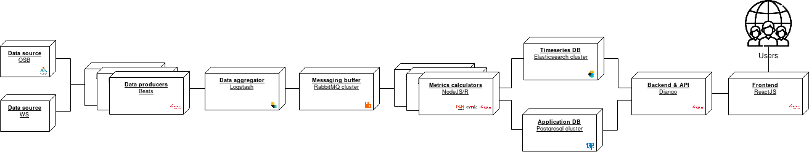
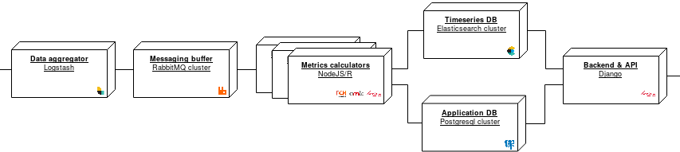
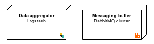
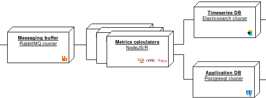
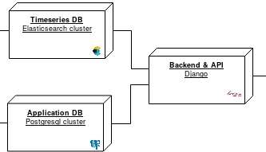

.. _architecture:

Arquitectura
============

Vista general
-------------

La plataforma está construida a partir del `stack ELK/Beats
<https://www.elastic.co/elk-stack>`_, además de un buffer de
mensajería `RabbitMQ <https://www.rabbitmq.com/>`_, una base de datos
relacional `PostgreSQL <https://www.postgresql.org/>`_ y una API REST
implementada en `Django <https://www.djangoproject.com/>`_.

   Vista general de la arquitectura

En la figura se observan los principales componentes de la
arquitectura, organizados de izquierda a derecha según uno de los
procesos de recolección de datos: desde fuentes externas conectadas a
través de recolectores automáticos.

El foco de este documento está en los componentes centrales de la
arquitectura, aislados en el siguiente diagrama:

   Vista de los componentes centrales de la arquitectura

Conceptualmente, se trata de:

- una capa de concentración y despacho de mensajes
- un conjunto de calculadores que son *activados* con mensajes
- una capa de persistencia, separada en dos bases de datos
- una interfaz de acceso a datos

Concentración de eventos
------------------------

   Componentes para la concentración de eventos

Los :term:`eventos <Evento>` provenientes de fuentes externas siguen
uno de dos posibles caminos:

- Son recopilados por Logstash
- Son depositados directamente en un *exchange* en RabbitMQ

Logstash es un componente que puede intervenir streams de datos y
concentrar datos de distintas fuentes, y como tal es tolerante a alta
carga. Por esta razón, Logstash se encarga de dosificar el flujo de
datos de fuentes automáticas hacia el *exchange* en RabbitMQ.

El `exchange en RabbitMQ
<https://www.rabbitmq.com/tutorials/amqp-concepts.html>`_ es el puente
agnóstico de comunicación entre componentes de la arquitectura, y
permite a los calculadores recibir eventos desde colas de mensajes.

.. _calculators:

Calculadores
------------

   Calculadores de índices

Los calculadores de :term:`índices<Índice>` son activados con la
llegada de eventos en la cola de mensajes, y persisten sus resultados
en la base de datos de series de tiempo --Elasticsearch.

Interfaz de acceso a los datos
------------------------------

   API REST de acceso a las bases de datos

Como interfaz común de acceso a la base de datos
relacional --PostgreSQL-- se usa una API HTTP REST implementada el
framework Django. La base de datos relacional almacena información
jerárquica y estructurada sobre las series de tiempo y su
caracterización.
