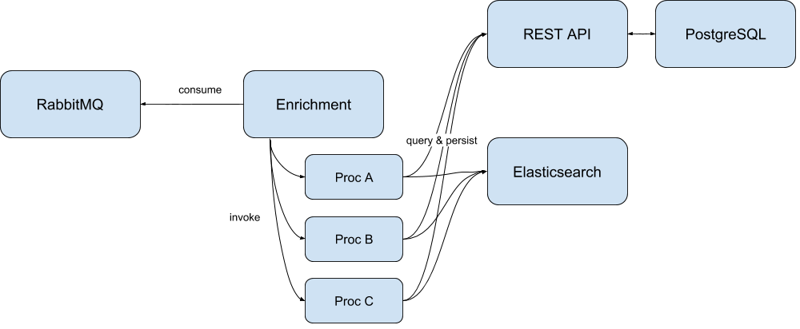
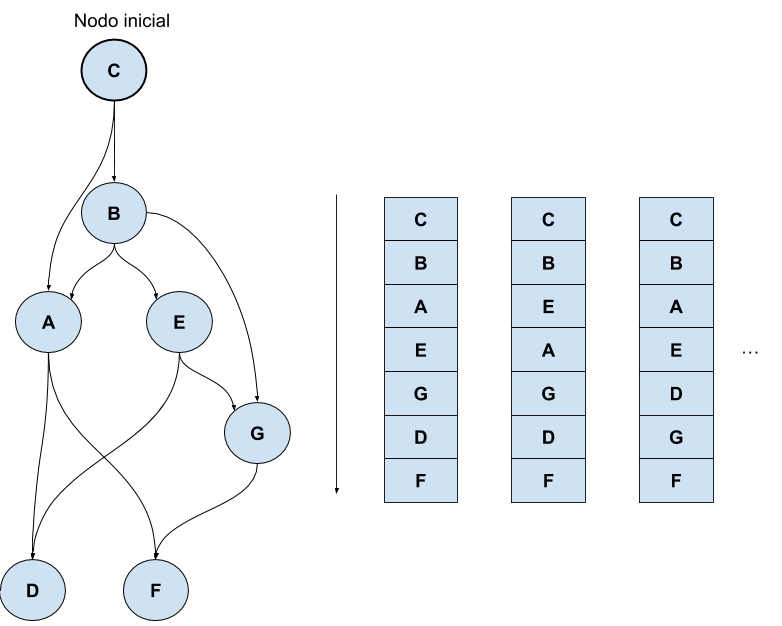
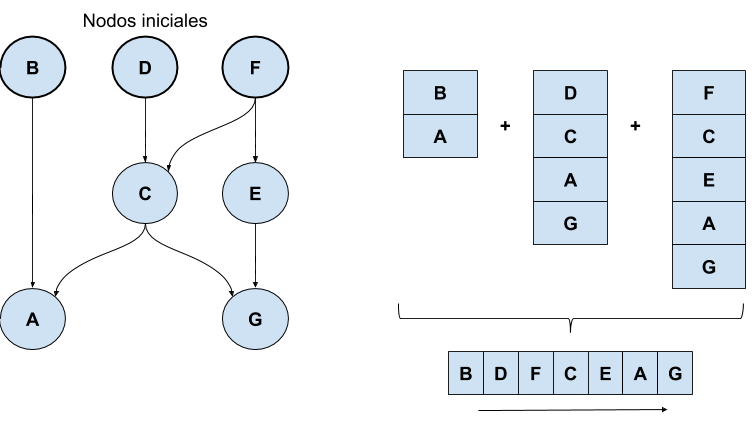

.. _execution:

Modelo de proceso
=================

El "proceso" en cuestión es en realidad la función de los componentes
calculadores, mencionados inicialmente en :ref:`calculators`, que
consiste en su nivel más general en la *ejecución de procedimientos en
base a series de tiempo*.

La arquitectura de la plataforma permite cumplir con esta función en
distintos niveles de generalidad, niveles que se asocian también a
grados de restricción en las herramientas a usar.

Se describen a continuación estos niveles en orden de más general a
más particular, que se corresponde con el orden creciente de
cantidad y severidad de las restricciones impuestas.

RabbitMQ exchange
-----------------

El único requisito de un componente calculador es el de ser capaz de
`consumir mensajes desde un exchange específico en el broker AMQP
<https://www.rabbitmq.com/consumers.html>`_. Las variables de
configuración (i.e. de entorno) ``AMQP_HOST``, ``AMQP_EXCHANGE`` y
``AMQP_TOPIC`` describen el host del broker, el nombre del exchange y
el tópico al que el calculador debe suscribirse.

Cada mensaje será un objeto en formato JSON que contendrá los eventos
emitidos recientemente. Los eventos emitidos pertenecerán a
:term:`series de tiempo crudas<Serie de tiempo cruda>`.

Finalmente, las siguientes variables de configuración expondrán el
acceso a los otros componentes de la arquitectura --la base de datos
Elasticsearch, y la base de datos relacional:

- ``ELASTICSEARCH_HOST`` y ``ELASTICSEARCH_PORT`` entregan acceso a la
  base de datos Elasticsearch.
- ``DATABASE_*``, con ``*`` siendo ``HOST``, ``PORT``, ``NAME`` ,
  ``USER`` y ``PASSWORD``, proveen acceso a la base de datos PostgreSQL.

Módulos de cálculo dentro de *enrichment*
-----------------------------------------

*enrichment* es el calculador de la plataforma, y como tal es un
consumidor de mensajes AMQP como se describe en la sección anterior.

*enrichment* se encarga del consumo de mensajes desde el exchange, y
de la conexión con la base de datos Elasticsearch y la base de datos
PostgreSQL, entregando una fundación para la rápida integración de
procedimientos calculadores. Las restricciones impuestas por
Enrichment para dichos procedimientos son:

- deben estar escritos en el lenguaje de programación
  Javascript, como es entendido por `NodeJS v10
  <https://nodejs.org/docs/latest-v10.x/api/index.html>`_.
- deben llamarse ``handler``, y deben recibir dos parámetros: el
  objeto mensaje, y un objeto con las conexiones a los otros
  componentes de la plataforma ya preparadas.

La integración se concreta con la inclusión (e.g. via volumen
compartido) de la implementación de cada procedimiento --empaquetado
en directorios-- en el directorio raíz de las implementaciones
(configurable a través de la variable ``IMPLEMENTATION_BASE``, o
``./impl`` por omisión).

Un ejemplo de integración de tres procedimientos de cálculo llamados
*proc-a*, *proc-b* y *proc-c* se observa en el siguiente listado de
directorios:

.. code-block:: bash

   $ tree impl
   impl
   ├── proc-a
   │    └── index.js
   ├── proc-b
   │    ├── auxiliary.js
   │    └── index.js
   └── proc-c
        └── index.js

Luego, con la llegada de cada mensaje desde el exchange, *enrichment*
ejecutará los procedimientos ``handler`` expuestos en cada archivo
``index.js`` de cada procedimiento, con el mensaje y las conexiones
entregadas como argumentos.

   Enrichment como fundación para procedimientos de cálculo

El mensaje obtenido desde el exchange tendrá una colección de eventos
en el campo ``events``.

El objeto con las conexiones preparadas es una estructura con los
siguientes campos:

- ``conf``, un catálogo de variables de configuración obtenidas desde
  el entorno.
- ``log``, un módulo para emitir mensajes de bitácora con distintos
  niveles de severidad.
- ``backend``, la conexión a la base de datos relacional PostgreSQL,
  controlada a través de procedimientos específicos.
- ``timeseries``, la conexión a Elasticsearch a través de el `cliente
  oficial
  <https://www.elastic.co/guide/en/elasticsearch/client/javascript-api/current/index.html>`_.
- ``stats``, la conexión con un servicio de procedimientos auxiliares,
  disponibilizado para implementar cálculos complejos.

Un ejemplo de procedimiento de cálculo integrado a *enrichment* puede ser:

.. code-block:: javascript

   // file: impl/proc-a/index.js

   // this fake procedure will sum all events given that belong to
   // a specific time series
   module.exports.handler = async ({events}, {log, backend, timeseries}) => {
     log.info("I'm here inside proc-a and received a message")
     const [ts] = await backend.timeseries(["some-target.some-timeseries"])
     const eventsOfInterest = events.filter((event) => event.name === ts.canonical_name)
     const [year, month] = (new Date()).toJSON().slice(0, 7).split("-")
     const partition = `derived-${year}.${month}`
     await timeseries.client.index({
       index: partition,
       type: "doc",
       body: {
         "name": "some-target.some-sum",
         "value": eventsOfInterest.reduce((acc, event) => event.value + acc, 0),
         "@timestamp": (new Date()).toJSON(),
         "labels": []
       }
     })
   }

.. _declared-procedures:

Motor de ejecución de procedimientos declarados
-----------------------------------------------

Los mecanismos de implementación de calculadores descritos arriba
están desacoplados de los :ref:`grafos de dependencia<fig-graph>`, y
no están sujetos a restricciones asociadas a esas estructuras. Un
calculador implementado como procedimiento en *enrichment* podría, por
ejemplo, persistir eventos en series de tiempo inexistentes en la base
de datos relacional, o en aquellas que no tienen relación alguna con
los eventos presentes en cada mensaje.

Con el afán de respetar el grafo de dependencia de un índice,
*enrichment* cuenta con un procedimiento de cálculo llamado *engine*,
que cumple la función de ejecutar los procedimientos declarados en
:ref:`templates`, según el orden lógico establecido por cada grafo.

Sin detallar las funciones de *engine*, podemos describir su modo de
operación como sigue:

1. Extraer desde la base de datos PostgreSQL el orden topológico de
   ejecución (el **plan de ejecución**), a partir de los eventos
   presentes en el mensaje.
2. Para cada elemento en el plan de ejecución, obtener su
   procedimiento declarado.
3. Ejecutar cada procedimiento declarado, proveyéndole capacidades de
   acceso a las bases de datos.
4. Persistir los resultados de cada procedimiento.

Los puntos 1 y 3 merecen una revisión más minuciosa.

Planes de ejecución
^^^^^^^^^^^^^^^^^^^

La primera tarea de *engine* es obtener un orden lógico de
procedimientos declarados a ejecutar, dado un mensaje con eventos. El
orden de los procedimientos corresponde a un ordenamiento de las
series de tiempo que dependen, directamente o por transitividad, de
las series de tiempo crudas que contienen a los eventos recién
llegados.

Comenzando por el caso trivial de un único evento recién llegado, se
puede describir el problema como:

    Encontrar el orden topológico de un digrafo dado un nodo inicial.

   Posibles órdenes topológicos de un digrafo

Si bien el ordenamiento se traduce en una estructura lineal, habrán
series de tiempo que no serán estrictamente dependientes de sus
antecesoras (por eso hay varias soluciones al problema), y por lo
tanto podrían atenderse **en paralelo** a otras. La linearización del
plan de ejecución es una **simplificación** tanto para los pasos
siguientes de *engine* (i.e. evita considerar paralelismo), como para
la generalización del plan de ejecución.

Dicha generalización debe considerarse cuando el mensaje obtenido
contiene **varios eventos de distintas series de tiempo**. En el grafo
de cómputo, esto significa que la activación sucede en varias series
de tiempo crudas simultáneamente. El siguiente problema es entonces:

    Combinar los ordenamientos de series de tiempo en un ordenamiento
    general, que respete los órdenes parciales de cada uno.

   Combinación de planes de ejecución

El resultado de esta combinación es el **plan de ejecución del
mensaje** y determina el orden de ejecución de los procedimientos
declarados.

.. _execution-api:

API de procedimientos declarados
^^^^^^^^^^^^^^^^^^^^^^^^^^^^^^^^

Un procedimiento declarado para una serie de tiempo derivada es código
Javascript que cuenta con algunas funcionalidades preparadas en
variables globales. El procedimiento puede hacer uso de estas
variables, que junto con las capacidades del lenguaje de programación
forman una interfaz de programación de procedimientos declarados.

*engine* prepara estas variables globales antes de ejecutar cada
procedimiento, inyectándolas al contexto de ejecución.

``ctx.timeframe``
"""""""""""""""""

Es una **constante**, un objeto que representa el intervalo de tiempo
que contiene a los eventos en el mensaje. ``ctx.timeframe.start`` y
``ctx.timeframe.from`` contienen la marca de tiempo inicial (string en
formato ISO 8601). ``ctx.timeframe.end`` y ``ctx.timeframe.to``
contienen la marca de tiempo final.

``ctx.now``
"""""""""""

Es una **constante**, la marca de tiempo de ejecución del
procedimiento declarado.

``ctx.rootRef``
"""""""""""""""

Es una **constante**, la *referencia* a la serie de tiempo siendo
derivada. Una referencia es, en este contexto, un objeto con
propiedades de interés de la serie de tiempo. La estructura del objeto
está determinada por el schema de la base de datos relacional. Algunas
propiedades que destacan son:

- ``canonical_name``, el nombre de la serie de tiempo (coincide con el
  nombre en cada evento)
- ``active_thresholds``, una lista de umbrales de la serie de tiempo

``refs.match``
""""""""""""""

.. code-block:: javascript

   refs.match = (pattern = "*") => {/* ... */}

Es un **procedimiento síncrono**, retorna un único nombre de serie de
tiempo que es entrada de la actual (i.e. ``rootRef``). El argumento es
un patrón que se usará para seleccionar el nombre coincidente. Si más
o menos de un nombre coincide, se lanzará un error. El patrón es un
string donde el símbolo ``*`` es el único *wildcard* disponible, y
expande a "cualquier símbolo, cualquier cantidad de veces".

``refs.expand``
"""""""""""""""

.. code-block:: javascript

   refs.expand = (pattern = "*") => {/* ... */}

Es un **procedimiento síncrono**, retorna una lista de nombres de
series de tiempo que son entradas de la actual. El argumento es un
patrón que se usará para seleccionar los nombres coincidentes.

``refs.getOne``
"""""""""""""""

.. code-block:: javascript

   refs.getOne = async (pattern = "*") => {/* ... */}

Es un **procedimiento asíncrono**, retorna una referencia a la serie
de tiempo cuyo nombre coincide con el patrón dado, y que es una
entrada de la serie actual. El procedimiento falla si el patrón
entrega más o menos de una coincidencia. El objeto referencia tiene la
misma forma que ``ctx.rootRef``.

``refs.getMany``
""""""""""""""""

.. code-block:: javascript

   refs.getMany = async (...patterns) => {/* ... */}

Es un **procedimiento asíncrono**, retorna una lista de referencias a
series de tiempo cuyos nombres coinciden con los patrones dados,
expandiendo cada patrón a una lista de coincidencias. El procedimiento
usa menos conexiones y es más eficiente que la siguiente combinación,
que entrega los mismos resultados:

.. code-block:: javascript

   // Esto es ineficiente, pero tiene el mismo resultado que
   // refs.getMany(...patterns)
   Promise.all(
     patterns
       .map((pattern) => refs.expand(pattern))
       .reduce((flat, names) => [...flat, ...names], [])
       .map((name) => refs.getOne(name))
   )

``refs.acquireProtocol``
""""""""""""""""""""""""

.. code-block:: javascript

   refs.acquireProtocol = async (protocol, meta, decider = () => false) => {/* ... */}

Es un **procedimiento asíncrono**, ejecuta la adquisición de un
**protocolo** asociado a la serie de tiempo actual. El protocolo es un
estado externo a la serie de tiempo, representado por un identificador
y metadatos asociados. Si la serie de tiempo ya había adquirido un
protocolo anteriormente, el procedimiento *decider* se ejecuta con el
protocolo anteriormente adquirido como argumento. Si *decider* retorna
``true``, el nuevo protocolo reemplazará al anterior. El objeto
protocolo entregado a decider tiene la forma:

.. code-block:: typescript

   interface IAcquiredProtocol {
     created_at: string;
     timeseries: string;
     protocol: string;
     meta: any;
   }

Donde ``created_at`` es una marca temporal, ``timeseries`` es el
nombre canónico de la serie, ``protocol`` es el identificador del
protocolo y ``meta`` será lo que fue asignado como metadatos en la
adquisición anterior.

``refs.getReferencePoint``
""""""""""""""""""""""""""

.. code-block:: javascript

   refs.getReferencePoint = async (name) => {/* ... */}

Es un **procedimiento asíncrono**, obtiene el punto referente con el
nombre *name* especificado, si existe. Si no, retornará ``null``. El
nombre de un punto referente será único para el punto asociado al
contexto de ejecución.

``series.query``
""""""""""""""""

.. code-block:: javascript

   series.query = async (specs) => {/* ... */}

Es un **procedimiento asíncrono**, retorna el resultado de ejecutar
una consulta a la base de datos Elasticsearch. La consulta se
construye con *specs*, un objeto o arreglo de objetos que se traducen
a queries Elasticsearch. La forma de cada *spec* es:

- ``{head: <pattern|ref>, tag: <string>, valueEq: <number>, valueGt:
  <number>, valueLt: <number>, valueGte: <number>, valueLte:
  <number>}``, que significa "el último valor de la serie de tiempo
  representada por *pattern* o *ref*". Si se usa un patrón como en
  ``refs.getOne`` o ``refs.match``, el patrón debe coincidir con el
  nombre de sólo una serie de tiempo de entrada. *tag* es un filtro
  adicional, opcional, que exige que el evento seleccionado cumpla con
  el tag especificado. Los filtros de la forma *valueOperador* son
  opcionales, y determinan condiciones que el valor de la serie debe
  tener.
- ``{slice: <pattern|ref>, since: <timestamp>, until: <timestamp>,
  count: <number>, tag: <string>, valueEq: <number>, valueGt:
  <number>, valueLt: <number>, valueGte: <number>, valueLte:
  <number>}``, que significa "los últimos valores entre las marcas de
  tiempo *since* y *until*, limitadas a *count* elementos y empezando
  desde la más reciente en el intervalo". El patrón *pattern* debe
  coincidir con un sólo nombre. *tag* indica un tag que deben poseer
  los eventos en el resultado. *count*, *since*, *until* y *tag* y
  todos los filtros de la forma *valueOperador* son opcionales.

``series.query`` usa sólo una conexión con el servidor Elasticsearch
para todas las consultas, de modo que es más eficiente que ejecutar
``series.query`` varias veces con consultas individuales.

``series.queryAll``
"""""""""""""""""""

.. code-block:: javascript

   series.queryAll = async (spec) => {/* ... */}

Es un **procedimiento asíncrono**, retorna el resultado de ejecutar la
consulta especificada por *spec*, pero aplicando internamente
``refs.expand`` en vez de ``refs.match``. Es útil para aplicar una
misma consulta a un conjunto de series de tiempo, sin tener que
expandir un patrón explícitamente.

``series.current``
""""""""""""""""""

.. code-block:: javascript

   series.current = (ref) => {/* ... */}

Es un **procedimiento síncrono**, retorna los valores en caché de la
serie de tiempo referenciada por *ref* (patrón o referencia). Los
valores de una serie de tiempo estarán en caché si:

- están contenidos en el mensaje (consumido desde el exchange
  RabbitMQ),
- fueron persistidos a través de ``series.save``.

Los valores consultados a través de ``series.query`` y
``series.queryAll`` *también serán persistidos en caché*, pero en otro
separado del que se usa para los propósitos de ``series.current``.

``series.earliest``
"""""""""""""""""""

.. code-block:: javascript

   series.earliest = async (ref, spec = {}) => {/* ... */}

Es un **procedimiento asíncrono**, que retorna el resultado de
ejecutar una consulta a la base de datos de series temporales según la
especificación *spec*, que tiene la misma forma que para
``series.query`` y ``series.queryAll`` en su variante ``slice``, pero
invirtiendo el orden de los resultados. Así, por ejemplo, una consulta
de la forma:

.. code-block:: javascript

   const [earliestValue] = await series.earliest("*", {count: 1});

Entregará el primer valor de la serie temporal en la base de
datos. Este procedimiento no hace uso de caché, y existe sólo para
casos de borde. El uso normal del resto de los procedimientos en
``series`` consiste en leer los valores **más recientes** de series
temporales. Este procedimiento invierte el orden de acceso, y por lo
tanto siempre resolverá los resultados desde lo menos reciente. El
parámetro ``spec`` puede tener las mismas opciones aceptadas por la
query ``slice``.

Los resultados de este procedimiento siempre estarán ordenados **de
menos reciente a más reciente**.

``series.save``
"""""""""""""""

.. code-block:: javascript

   series.save = (value, timestamp = ctx.timeframe.end, coords = null) => {/* ... */}

Es un **procedimiento síncrono**, *agenda* la persistencia del valor
en Elasticsearch, como un evento de la serie de tiempo actual
(``ctx.rootRef``). La persistencia ocurre después de completada la
ejecución del procedimiento declarado.

``utils.debug``
"""""""""""""""

.. code-block:: javascript

   utils.debug = (msg) => {/* ... */}

Es un **procedimiento síncrono**, emite un evento de *log* al stream
de logs de *enrichment*.

``utils.isDefined``
"""""""""""""""""""

.. code-block:: javascript

   utils.isDefined = (v) => typeof v !== "undefined"

``utils.isUndefined``
"""""""""""""""""""""

.. code-block:: javascript

   utils.isUndefined = (v) => typeof v === "undefined"

``utils.timestampInInterval``
"""""""""""""""""""""""""""""

.. code-block:: javascript

   utils.timestampInInterval = (ts, from, to) => {/* ... */}

Es un **procedimiento síncrono**, retorna si acaso la marca temporal
*ts* está contenida en el intervalo temporal definido por *from* y
*to*, ambos límites incluídos.

``utils.timestampEquals``
"""""""""""""""""""""""""

.. code-block:: javascript

   utils.timestampEquals = (tsA, tsB, tolerance = 0) => {/* ... */}

Es un **procedimiento síncrono**, retorna si acaso la marca temporal
*tsA* es equivalente a la marca temporal *tsB* considerando un error
máximo de *tolerance* en milisegundos.

``utils.monthsAgo``
"""""""""""""""""""

.. code-block:: javascript

   utils.monthsAgo = (ts, months) => {/* ... */}

Es un **procedimiento síncrono**, retorna una marca temporal que es
igual a *ts* desplazada *months* meses hacia el pasado.

``utils.daysAgo``
"""""""""""""""""

.. code-block:: javascript

   utils.daysAgo = (ts, days) => {/* ... */}

Es un **procedimiento síncrono**, retorna una marca temporal que es
igual a *ts* desplazada *days* días hacia el pasado.

``utils.minutesAgo``
""""""""""""""""""""

.. code-block:: javascript

   utils.minutesAgo = (ts, minutes) => {/* ... */}

Es un **procedimiento síncrono**, retorna una marca temporal que es
igual a *ts* desplazada *minutes* minutos hacia el pasado.

``utils.secondsAgo``
""""""""""""""""""""

.. code-block:: javascript

   utils.secondsAgo = (ts, seconds) => {/* ... */}

Es un **procedimiento síncrono**, retorna una marca temporal que es
igual a *ts* desplazada *seconds* segundos hacia el pasado.

``utils.diffInMonths``
""""""""""""""""""""

.. code-block:: javascript

   utils.diffInMonths = (ts1, ts2) => {/* ... */}

Es un **procedimiento síncrono**, retorna un número decimal con la
cantidad de meses entre las marcas temporales *ts1* y *ts2*. El número
será positivo si *ts1* es más reciente que *ts2*.

``utils.diffInDays``
""""""""""""""""""""

.. code-block:: javascript

   utils.diffInDays = (ts1, ts2) => {/* ... */}

Es un **procedimiento síncrono**, retorna un número decimal con la
cantidad de días entre las marcas temporales *ts1* y *ts2*. El número
será positivo si *ts1* es más reciente que *ts2*.

``utils.diffInMinutes``
""""""""""""""""""""

.. code-block:: javascript

   utils.diffInMinutes = (ts1, ts2) => {/* ... */}

Es un **procedimiento síncrono**, retorna un número decimal con la
cantidad de minutos entre las marcas temporales *ts1* y *ts2*. El
número será positivo si *ts1* es más reciente que *ts2*.

``utils.diffInSeconds``
""""""""""""""""""""

.. code-block:: javascript

   utils.diffInSeconds = (ts1, ts2) => {/* ... */}

Es un **procedimiento síncrono**, retorna un número decimal con la
cantidad de segundos entre las marcas temporales *ts1* y *ts2*. El
número será positivo si *ts1* es más reciente que *ts2*.

``utils.stats``
"""""""""""""""

.. code-block:: javascript

   utils.stats = async (path, args) => {/* ... */}

Es un **procedimiento asíncrono**, invoca la ejecución de
procedimientos auxiliares, cada uno identificado por *path* y con el
objeto *args* como argumento.

Los procedimientos auxiliares son parte de otro repositorio, y
encapsulan cálculos complejos y específicos a áreas de estadística. La
documentación de los procedimientos auxiliares se puede encontrar en
su `repositorio <https://gitlab.com/Inria-Chile/tranque/stats>`_.

``utils.distance``
""""""""""""""""""

.. code-block:: javascript

   utils.distance = async (p1, p2) => {/* ... */}

Es un **procedimiento asíncrono**, calcula la distancia geográfica
entre dos puntos con coordenadas (esto es, que tienen una propiedad
``coords``). Los puntos que tienen coordenadas geográficas son:
*[<ref>.data_sources]* las fuentes de datos,
*ctx.rootRef.getReferencePoint(<name>)* los puntos de referencia, y
*<ref>.target* el objetivo de monitoreo.
