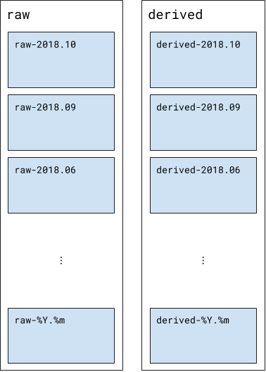
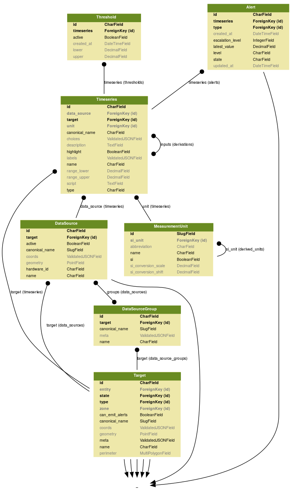
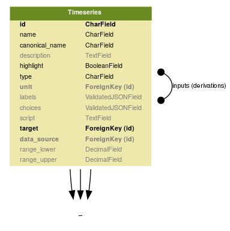
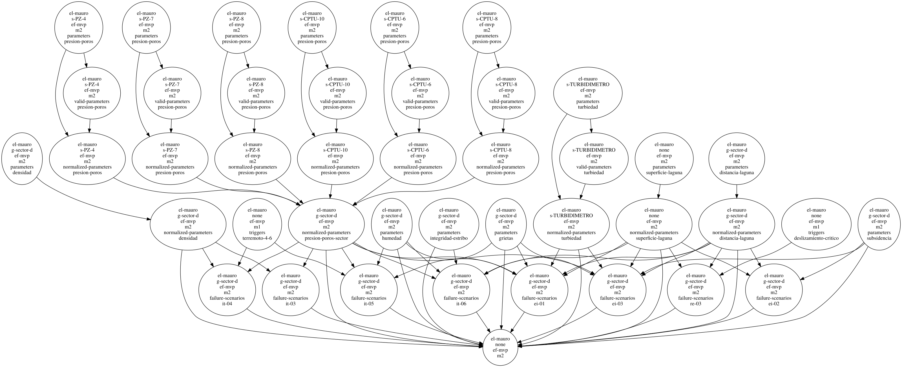
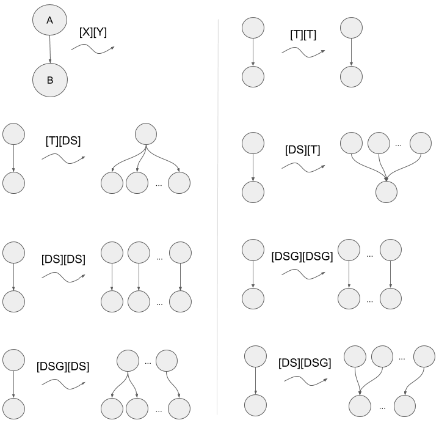
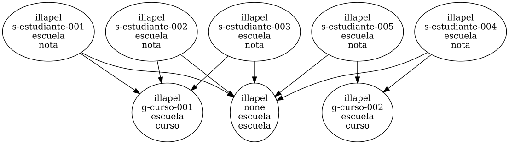

.. _schema:

Modelo de datos
===============

Tranque opera con dos motores de base de datos:

- Un RDBMS, PostgreSQL, que se encarga de persistir la información
  jerárquica que soporta la lógica de la aplicación.
- Un motor no relacional, Elasticsearch, que se encarga de persistir
  los eventos de forma escalable.

Eventos
-------

Un :term:`evento<Evento>` tiene una única estructura, formando así
colecciones homogéneas. Usando la sintaxis de Elasticsearch para la
definición de *mappings*, la estructura de un evento es:

.. code-block:: json

   {
     "dynamic": false,
     "_source": {
       "includes": [
         "@timestamp",
         "value",
         "name",
         "coords.x",
         "coords.y",
         "coords.z",
         "labels.key",
         "labels.value",
         "meta"
       ]
     },
     "properties": {
       "@timestamp": {"type": "date"},
       "value": {"type": "double"},
       "name": {"type": "keyword"},
       "coords": {
         "type": "object",
         "dynamic": false,
         "properties": {
           "x": {"type": "double"},
           "y": {"type": "double"},
           "z": {"type": "double"}
         }
       },
       "labels": {
         "type": "nested",
         "dynamic": false,
         "properties": {
           "key": {"type": "keyword"},
           "value": {"type": "keyword"}
         }
       },
       "meta": {
         "type": "object",
         "enabled": false
       }
     }
   }

Esto es, un evento es un objeto con las propiedades ``@timestamp`` (su
marca temporal), ``name`` (el identificador de la serie de tiempo), y
``value`` (el valor del evento). Adicionalmente, en una colección de
etiquetas adyacente ``labels`` se guardan etiquetas auxiliares cuyo
propósito debiese ser exclusivamente informativo, es decir, debiesen
contribuir a la trazabilidad de un evento pero no condicionar su
valor. El campo ``coords`` se puede también usar para guardar
información espacial del evento. El campo ``meta`` puede almacenar
objetos asociados al evento, pero éstos no serán indexados y por lo
tanto podrán ser parte de búsquedas u ordenamientos.

Un ejemplo de evento se observa a continuación:

.. code-block:: json

   {
     "@timestamp": "2018-10-30T00:00:00",
     "name": "el-mauro.g-aguas-abajo.emac-mvp.riego.ir",
     "value": 0.10045270660267688,
     "labels": [
       {
         "value": "bac78d8f22fe579ecdb6c01eb09972797f021dbc",
         "key": "enrichment-version"
       },
       {
         "value": "derived",
         "key": "type"
       }
     ]
   }

.. note:: Un evento sólo contiene valores numéricos. La potencial
   necesidad de persistir valores cualitativos (e.g. enumeraciones)
   debe resolverse en la lógica de aplicación mediante biyecciones
   apropiadas. El campo ``meta`` puede asistir en la persistencia de
   información cualitativa al evento, pero esta información no podrá
   usarse directamente en las búsquedas, ordenamientos o agregaciones
   de los eventos.

Particiones
-----------

Los eventos son persistidos en particiones de la base de datos
Elasticsearch, que se definen de acuerdo a dos criterios:

1. La marca temporal del evento, considerando sólo su año y mes.
2. La proveniencia del evento, separando así series de tiempo crudas
   de las derivadas.

El diagrama :ref:`fig-partitioning` muestra el esquema de partición de
la base de datos de eventos.

.. _fig-partitioning:

   Particiones de la base de datos de eventos

Este esquema de partición se justifica con dos principios:

1. Controlar la persistencia de los datos externos a la plataforma de
   forma independiente de los datos generados por la plataforma,
   puesto que los primeros son la **fuente de verdad** de los procesos
   de derivación, y por lo tanto merecen asilamiento inmediatamente
   identificable.
2. Archivar los datos históricos en bloques de tamaño apropiado.

Modelo de datos relacional
--------------------------

El modelo de datos jerárquico que soporta la lógica de la aplicación
es generado con el `ORM de django
<https://docs.djangoproject.com/en/2.1/topics/db/models/>`_, y se
enfoca en la infraestructura necesaria para monitorear *objetivos de
monitoreo* (e.g. depósitos de relave), a través de la inspección de
eventos en series de tiempo.

Las entidades del modelo que son centrales para este documento se
pueden apreciar en el diagrama :ref:`fig-model`.

.. _fig-model:

   Modelo de datos relacional

En el modelo, desde abajo hacia arriba las entidades son:

===============  ===================================================
Entidad          Descripción
===============  ===================================================
Target           Objetivo de monitoreo (e.g. depósito de relave)

DataSourceGroup  Grupo lógico de fuentes de datos (e.g. piezómetros)

DataSource       Fuente de datos (e.g. Piezómetro ABC123)

MeasurementUnit  Unidad de medida (e.g. metros, milígramos, newtons)

Timeseries       Serie de tiempo, que contiene la referencia a todos
                 los eventos correspondientes a la serie en la base
                 de datos Elasticsearch

Threshold        Umbral declarado para una serie de tiempo

Alert            Alerta asociada a una serie de tiempo
===============  ===================================================

En el modelo, la cardinalidad de una relación se observa en los
extremos de cada arista:

- un extremo terminado en un círculo negro indica pluralidad
- un extremo sin decoración en su extremo indica singularidad

Una relación particularmente significativa es aquella que tienen las
:term:`series de tiempo<Serie de tiempo>` (*Timeseries*) con sigo
mismas. La relación indica que una serie de tiempo depende lógicamente
de otras (en el sentido algebraico de dependencia), y a su vez es una
dependencia de muchas otras.

   Modelo de serie de tiempo

Es esta relación la que permite construir un **grafo de dependencia**
a partir de una serie de tiempo específica. Un ejemplo de grafo de
dependencia materializado en la base de datos relacional puede verse
gráficamente en :ref:`fig-graph`.

.. _fig-graph:

   Ejemplo de grafo de dependencia

.. _templates:

Plantillas de series de tiempo
------------------------------

Si bien el modelo relacional ya es capaz de alojar la declaración de
series de tiempo y sus dependencias, la brecha conceptual entre el
modelo teórico de un índice y el modelo relacional es
considerable. Esto se traduce en la dificultad de convertir el modelo
teórico al *perfil de un depósito*, que se entiende como:

1. Su instrumentación operativa.
2. La clasificación de su instrumentación (e.g. sectorización).
3. Las series de tiempo derivadas que son relevantes para él.

Esta brecha provoca que el trabajo de "instalación" de un índice en un
depósito sea un trabajo tedioso y susceptible a errores humanos. Por
esto, la declaración de un índice se concreta no en su materialización
directa, sino que en la construcción de **plantillas de series de
tiempo**, estructuras que tienen mayoritariamente la forma de una
serie de tiempo en el modelo relacional, pero que a la vez pueden
expandirse sobre la instrumentación y agrupaciones disponibles.

En concreto, las plantillas son archivos en formato YAML que definen
los campos requeridos por el modelo relacional, además de campos
especiales que definen cómo se expande la plantilla sobre las
características del depósito. Un ejemplo de plantilla se puede ver a
continuación:

.. code-block:: yaml

   # file: emac-mvp/normalized-variables/riego/pb

   name: Pb -- Riego -- Normalizado

   scope: spread
   groups:
     query:
       canonical_name: monitoreo-aguas

   inputs:
     - "@emac-mvp/valid-variables/riego/pb"

   script: |
     const varRef = await refs.getOne("*");
     const events = series.current(varRef);
     const threshold = varRef.active_thresholds.find((t) => t.upper !== null)
     if (events.length > 0 && utils.isDefined(threshold)) {
       const thresholdValue = parseFloat(threshold.upper);
       const currentValue = Math.max(...events.map((event) => event.value));
       const normalized = 0.5 * (Math.tanh((currentValue - thresholdValue) / thresholdValue / 2) + 1);
       series.save(normalized);
     }

En el ejemplo, los campos ``scope`` y ``groups`` determinan cómo se
expande esta serie de tiempo derivada por sobre el dominio de
aplicación. ``scope: spread`` indica que la serie de tiempo debe
replicarse para cada fuente de datos apropiada, y ``groups: ...``
indica que las fuentes de datos apropiadas para esta serie de tiempo
son aquellas que pertenecen a grupos que coinciden con el nombre
canónico ``monitoreo-aguas``.

El campo ``script`` contiene el procedimiento declarado que ejecuta la
derivación. Cada procedimiento se rige por la especificación descrita
en :ref:`declared-procedures`.

La especificación completa de la estructura de las plantillas está
disponible en :ref:`templates-reference`.

Finalmente, las plantillas pueden ser *aplicadas* a un depósito
específico mediante una operación automática e idempotente, que
corresponde conceptualmente a la instalación del modelo teórico en el
depósito. El proceso de instalación generará múltiples series de
tiempo por cada plantilla, y preservará las relaciones de dependencia
de acuerdo a reglas específicas.

Topología en plantillas y su materialización
^^^^^^^^^^^^^^^^^^^^^^^^^^^^^^^^^^^^^^^^^^^^

Una plantilla es principalmente una guía para la expansión de una
serie de tiempo sobre el dominio, y como tal define cómo se preservan
las relaciones de dependencia entre las series luego de la
expansión. Se define que el *alcance* de una plantilla
(i.e. ``scope``) puede ser:

- nulo o "global al depósito"
- de expansión en fuentes de datos
- de expansión en grupos (de fuentes de datos)

Si bien el proceso de expansión es intuitivo, es pertinente explorar
las posibles transformaciones que sufren las aristas del grafo de
dependencia luego de la expansión.

Sea **scope** el alcance o modo de expansión con posibles valores
``T`` (global o nulo), ``DS`` (de expansión sobre fuentes de datos),
``DSG`` (de expansión sobre grupos). Sea ``[X][Y]`` la combinación de
dos scopes en una arista entre plantillas (e.g. plantilla *A* tiene
scope *X* y es dependencia de la plantilla *B* que tiene scope
*Y*). Los posibles escenarios se observan en :ref:`fig-topology`.

.. _fig-topology:

   Topología de expansión de plantillas

Los casos de la forma ``[T][T]``, ``[DS][DS]`` y ``[DSG][DSG]`` son
triviales: toda relación debe preservarse entre plantillas con el
mismo ámbito de expansión.

Los casos de la forma ``[T][DS]`` y ``[T][DSG]`` corresponden a una
expansión de la arista de dependencia: la única serie de tiempo
generada por la plantilla *A* pasa a ser la dependencia de todas las
series generadas por la plantilla *B*.

Los casos de la forma ``[DS][T]`` y ``[DSG][T]`` corresponden a la
integración en derivaciones globales (e.g. promedios, sumas, máximos).

Los casos que combinan scopes ``DS`` y ``DSG`` son similares a las dos
clasificaciones anteriores, sólo que limitados al alcance de cada
grupo de fuentes de datos, en vez de a todo el depósito.

.. note:: En la especificación de plantillas, los valores posibles de
   ``scope`` son nulo o no declarado (``T`` en el diagrama),
   ``spread`` (``DS`` en el diagrama), y ``group`` (``DSG`` en el
   diagrama).

Ejemplo
^^^^^^^

Para ilustrar la expansión de plantillas se presenta el siguiente
ejemplo:

    Se cuenta con las notas de los estudiantes de una escuela. Cada
    estudiante pertenece a un curso. Por cada curso, se calcula el
    promedio de notas. Además, se calcula el promedio de notas de toda
    la escuela.

La configuración de la escuela (sus fuentes de datos y sus
agrupaciones) está descrita por la siguiente tabla:

===============  ======================
DataSource       DataSourceGroup(s)
===============  ======================
estudiante-001   estudiante, curso-001

estudiante-002   estudiante, curso-001

estudiante-003   estudiante, curso-001

profesor-001     curso-001

estudiante-004   estudiante, curso-002

estudiante-005   estudiante, curso-002

profesor-002     curso-002
===============  ======================

La plantilla para la nota de un estudiante podría ser:

.. code-block:: yaml

   # file: escuela/nota.yml

   name: Nota
   type: manual

   scope: spread
   groups:
     query:
       canonical_name: estudiante

La plantilla para los promedios por curso podría ser:

.. code-block:: yaml

   # file: escuela/curso.yml

   name: Promedio de curso

   scope: group
   groups:
     query:
       canonical_name__startswith: curso-

   inputs:
     - "@escuela/nota"

   script: |
     const events = await series.queryAll({head: "*"});
     if (events.length > 0) {
       const sum = events
         .map((event) => event.value)
         .reduce((acc, v) => acc + v, 0);
       save(sum / events.length);
     }

La plantilla para el promedio de toda la escuela podría ser:

.. code-block:: yaml

   # file: escuela/escuela.yml

   name: Promedio de la escuela

   inputs:
     - "@escuela/nota"

   script: |
     const events = await series.queryAll({head: "*"});
     if (events.length > 0) {
       const sum = events
         .map((event) => event.value)
         .reduce((acc, v) => acc + v, 0);
       save(sum / events.length);
     }

En el ejemplo, la implementación del procedimiento de ambos promedios
es la misma. Sin embargo, al acceder a los eventos a través de la
consulta ``series.queryAll``, las series de tiempo seleccionadas serán
sólo las de un curso en el caso del promedio de curso, y las de toda
la escuela en el caso del promedio de la escuela. Esto se debe a las
diferencias en ``scope``, que quedarán claras con el complemento
:ref:`templates-reference`.

Para ilustrar de mejor forma el grafo resultante, es conveniente
revisar la ilustración :ref:`fig-example-graph`, que es el resultado
de instalar este *modelo teórico* sobre el objetivo *illapel*, y la
configuración dada más arriba.

.. _fig-example-graph:

   Grafo de series de tiempo en la escuela

Se observan dos resultados de interés:

- Los promedios de curso enlazan sólo a estudiantes del mismo curso.
- Aún cuando son fuentes de datos, los profesores, no siendo
  alcanzados por la declaración *spread* de la plantilla notas, no
  aparecen como emisores de ninguna serie de tiempo.

.. _templates-reference:

Referencia de archivos plantilla
^^^^^^^^^^^^^^^^^^^^^^^^^^^^^^^^

Una plantilla es mayoritariamente una serie de tiempo según el modelo
relacional. Sus propiedades son:

``name``
""""""""

Nombre breve pero descriptivo. Es un campo requerido, y será
intervenido en el proceso de expansión con información adicional: la
fuente de datos o el grupo de fuentes de datos.

``canonical_name``
""""""""""""""""""

Nombre canónico de la serie de tiempo. Se construye a partir del
nombre de archivo de la plantilla, y es intervenido en el proceso de
expansión con información de la fuente de datos o el grupo de fuentes
de datos. Sólo debe declararse en series de tiempo anidadas.

``description``
"""""""""""""""

Descripción más extensa de la serie de tiempo. No es requerido, ni es
intervenido en el proceso de expansión.

``highlight``
"""""""""""""

Booleano opcional indicando si la serie de tiempo debe resaltarse. Una
serie resaltada es usualmente un :term:`índice<Índice>`. Ser resaltada
sólo tiene significancia para interfaces gráficas de usuario, pero no
para el proceso de derivación.

``type``
""""""""

Tipo de serie de tiempo. Los valores posibles son ``raw`` (valores
obtenidos automáticamente), ``manual`` (valores ingresados
manualmente) o nulo (omitido que se traduce a ``derived``, valores
derivados). Una plantilla que tiene ``inputs`` se traducirá a series
de tiempo de tipo ``derived``. Una plantilla que no tiene ``inputs``
deberá especificar un valor para ``type``.

La distinción entre ``raw`` y ``manual`` sólo ocurre en interfaces
gráficas de usuario, no en el proceso de derivación.

``choices``
"""""""""""

Es un arreglo opcional con una traducción, caso a caso, de valores
numéricos de la serie a valores textuales. Cada valor en choices sigue
el siguiente *schema* (especificado en sintaxis JSON Schema):

.. code-block:: json

   {
     "type": "object",
     "properties": {
       "value": {
         "type": "object",
         "properties": {
           "choiceValue": {"type": "number"},
           "lt": {"type": "number"},
           "lte": {"type": "number"},
           "gt": {"type": "number"},
           "gte": {"type": "number"}
         },
         "additionalProperties": false,
         "required": ["choiceValue"]
       },
       "choice": {"type": "string"},
     },
     "additionalProperties": false,
     "required": ["value", "choice"]
   }

Un ejemplo sencillo de ``choices`` es el siguiente:

.. code-block:: yaml

   choices:
     - choice: "Sí"
       value:
         choiceValue: 1
         gt: 0
     - choice: "No"
       value:
         choiceValue: 0
         lte: 0

Que sirve para traducir valores menores o iguales a cero al texto
"No", y valores mayores que cero al texto "Sí". ``choices`` no tiene
influencia sobre el proceso de derivación, y se usa sólo en interfaces
gráficas de usuario.

``unit``
""""""""

Estructura que describe la unidad de medida de la serie de tiempo. Su
forma es:

- ``id``, clave natural de la unidad de medida
- ``name``, nombre descriptivo de la unidad de medida
- ``abbreviation``, abreviación estándar de la unidad de medida
- ``si``, booleano que indica si la unidad de medida pertenece al
  sistema internacional
- ``si_conversion_shift``, valor de conversión a sistema internacional
  por desplazamiento
- ``si_conversion_scale``, valor de conversión a sistema internacional
  por escalamiento
- ``si_unit``, estructura anidada que representa la unidad de medida
  correspondiente al sistema internacional (e.g. para kilómetros, la
  unidad correspondiente es metros)

``script``
""""""""""

Procedimiento declarado de derivación. Por el momento, corresponde a
un procedimiento escrito en el lenguaje de programación Javascript, a
ejecutarse en un entorno `NodeJS V10
<https://nodejs.org/docs/latest-v10.x/api/index.html>`_. El
procedimiento se ejecutará en un contexto `async/await
<https://developer.mozilla.org/en-US/docs/Web/JavaScript/Reference/Statements/async_function>`_
y contará con las utilidades descritas en :ref:`execution-api`.

``range_lower``
"""""""""""""""

Valor numérico opcional que determina el mínimo aceptable por una
serie de tiempo. Los procedimientos de derivación pueden o no usar
dicho valor en su ejecución.

``range_upper``
"""""""""""""""

Valor numérico opcional que determina el máximo aceptable por una
serie de tiempo. Los procedimientos de derivación pueden o no usar
dicho valor en su ejecución.

``thresholds``
""""""""""""""

Lista de objetos que representan umbrales de la serie de tiempo. Un
umbral es un objeto con propiedades ``upper`` o ``lower`` (o
ambas). Cada procedimiento de derivación puede o no hacer uso de los
umbrales de cada serie de tiempo.

``scope``
"""""""""

Determina el modo de expansión. Puede tener uno de tres valores:
``spread`` (expandir a fuentes de datos), ``group`` (expandir a grupos
de fuentes de datos), o nulo (omitido, que significa no expandir).

``groups``
""""""""""

Determina cómo aplicar la expansión según ``scope``. Una expansión se
aplica por sobre una selección de grupos de fuentes de datos, y
``groups`` determina qué grupos son los objetivos. Hay dos formas de
seleccionar grupos de fuentes de datos:

- A través de una consulta con el ORM de Django, en un objeto con la
  propiedad ``query`` que tenga como valor el filtro a aplicar por
  sobre el ORM, sobre la colección de grupos.
- Enumerando los grupos a elegir, que serán creados si no existen. La
  enumeración se anida en una propiedad ``items``.

``frequencies``
"""""""""""""""

Lista de objetos que representan frecuencias de la serie de tiempo,
asociadas a distintos protocolos de medición. Las propiedades
esperadas de cada objeto son:

- ``protocol`` (requerido) identificador del protocolo de medición
  (e.g. ``"protocolo-c"``)
- ``minutes`` (requerido) es el _periodo_ en minutos
- ``tolerance_lower`` es la tolerancia en minutos que se le resta a
  ``minutes`` para aceptar frecuencias mayores
- ``tolerance_upper`` es la tolerancia en minutos que se le suma a
  ``minutes`` para aceptar frecuencias menores

``inputs``
""""""""""

Lista opcional de plantillas de series de tiempo, o referencias a
ellas, que representan series de tiempo *de entrada*. Para referenciar
otra serie de tiempo se debe usar la ruta relativa desde la raíz del
directorio de plantillas.
